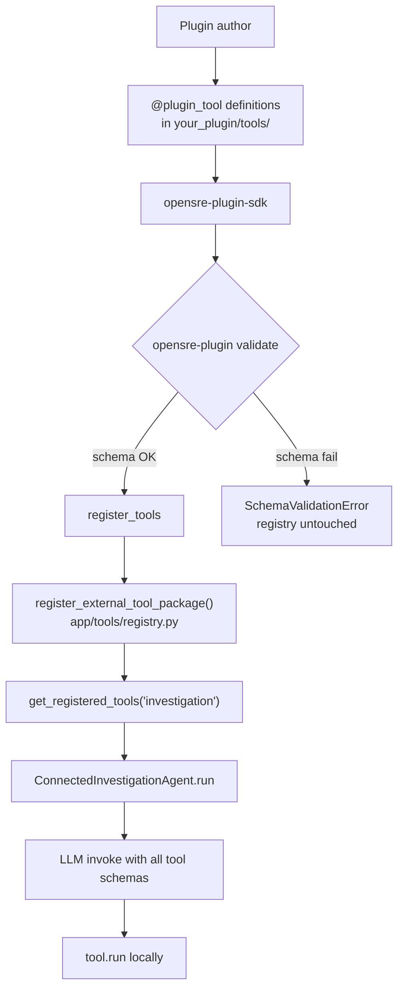

# Architecture

How external investigation tool plugins connect to OpenSRE without modifying the core repository.

## High-level flow



## Components

### Your plugin package

A normal Python package with:

- `pyproject.toml` — `[tool.opensre-plugin]` manifest
- `your_plugin/__init__.py` — `register()` entry point
- `your_plugin/tools/*.py` — one `@plugin_tool` per file (required for discovery)
- `your_plugin/client.py` — HTTP/SDK client (optional pattern)

OpenSRE's registry walks **top-level submodules** of the registered package the same way it walks `app.tools.*`. Tools defined only in `tools/__init__.py` are **not** discovered.

### opensre-plugin-sdk

| Module | Role |
|--------|------|
| `schema/validator.py` | Ports OpenSRE strict JSON Schema invariants |
| `decorators.py` | `@plugin_tool` — validate schema, delegate to `@tool` |
| `loader.py` | `register_tools()` — validate all tools, then call core registry |
| `manifest.py` | Parse `[tool.opensre-plugin]` from `pyproject.toml` |
| `cli/` | `init`, `validate`, `register` |

The SDK is a **boundary layer**: it catches schema bugs before they reach the investigation loop, where one bad schema breaks every LLM invoke.

### OpenSRE core (existing extension point)

```text
app/tools/registry.py
  register_external_tool_package(package)  # extension hook
  get_registered_tools("investigation")    # agent consumes this

app/agent/investigation.py
  ConnectedInvestigationAgent.run()        # ReAct loop
  → llm.invoke(messages, tools=tool_schemas)
  → tool.run(**kwargs)
```

Production OpenSRE does **not** call `register_external_tool_package()` itself. Your plugin (or your app's startup code) must call `register()` before `opensre investigate`.

## Runtime sequence

```text
1. User: pip install opensre-plugin-sdk your-plugin
2. User: python -c "from your_plugin import register; register()"
       → SDK validates schemas
       → register_external_tool_package(your_plugin.tools)
3. User: opensre investigate --alert '...'
4. Agent: get_registered_tools("investigation")
       → filters with tool.is_available(sources)
       → sends ALL schemas in one LLM request
5. LLM returns tool call → investigation dispatches tool.run()
```

## Credential flow (Phase 1)

Phase 1 plugins do **not** wire into `_catalog_impl.py` or the integration store. Credentials come from environment variables:

```text
is_available(sources)     → False if LINEAR_API_KEY unset → tool hidden from LLM
extract_params(sources)   → {"api_key": os.environ["LINEAR_API_KEY"]}
injected_params           → ("api_key",) hidden from LLM schema
run(query, api_key)       → client uses api_key
```

See [AUTHORING.md](AUTHORING.md) for the CloudOpsBench pattern with `injected_params`.

## What the SDK does not do (Phase 1)

- Auto-load plugins at `opensre` startup (no entry-point discovery yet)
- Register new `EvidenceSource` literals in core
- Add integrations to `opensre integrations list`
- Run verify probes via `opensre integrations verify`

See [PHASE1_VS_PHASE2.md](PHASE1_VS_PHASE2.md).

## Reference implementations

| Example | Location | Use case |
|---------|----------|----------|
| Mock (offline) | `examples/mock/` | CI, learning, no API |
| Linear (HTTP) | `examples/linear/` | Real vendor GraphQL |
| CloudOpsBench | [opensre/tests/benchmarks/cloudopsbench](https://github.com/Tracer-Cloud/opensre/blob/main/tests/benchmarks/cloudopsbench/tools/k8s/__init__.py) | In-repo external package pattern |

## Related

- [SCHEMA_RULES.md](SCHEMA_RULES.md)
- [AUTHORING.md](AUTHORING.md)
- [FAQ.md](FAQ.md)
